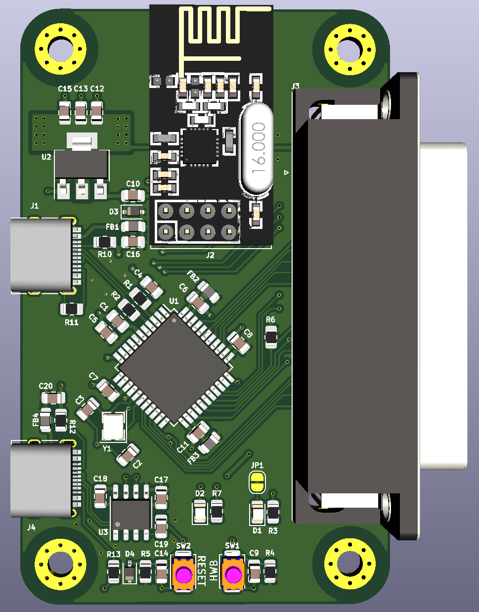
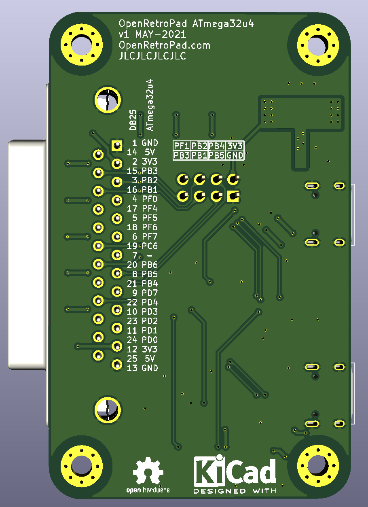

OpenRetroPad Hardware
=====================

This repository holds some hardware designs to support [OpenRetroPad](https://github.com/OpenRetroPad/OpenRetroPad) software development.

# ATmega32u4

## Hardware Info

Bootloader uses [PC7](https://github.com/arduino/ArduinoCore-avr/blob/master/bootloaders/caterina/Caterina.h#L69) as output for led pulsing in hardware bootloader mode ( https://github.com/arduino/ArduinoCore-avr/blob/master/bootloaders/caterina/Caterina.c#L151 and https://github.com/arduino/ArduinoCore-avr/blob/master/bootloaders/caterina/Caterina.c#L95 ). This LED can otherwise be used in user code for status indication.

Switch 1 (labelled 'HWB') enters hardware bootloader mode. Switch 2 (labelled 'Reset') resets the microcontroller.

DB25 <-> ATmega32u4 pinout is labelled on the back of the PCB. The NRF24 pins are also labelled.

USB DFU mode as per http://ww1.microchip.com/downloads/en/DeviceDoc/doc7618.pdf

DFU drivers can be found in [FLIP](https://www.microchip.com/developmenttools/ProductDetails/flip)
Flip is not required to be installed unless uploading a .hex file manually

Flags to avrdude to upload: -c flip1 -p m32u4 -P usb
Flip is not required to be installed for avrdude to use the protocol.